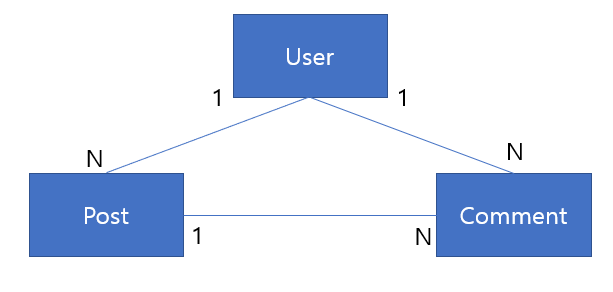
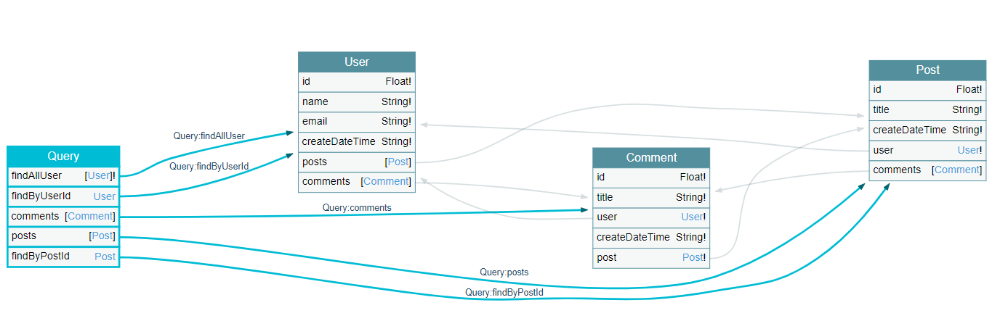
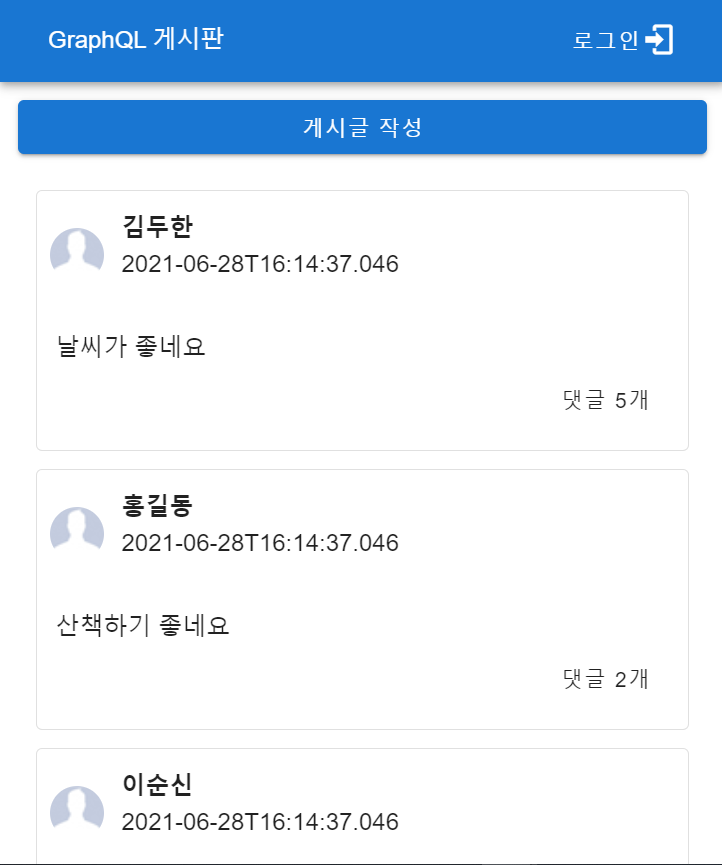
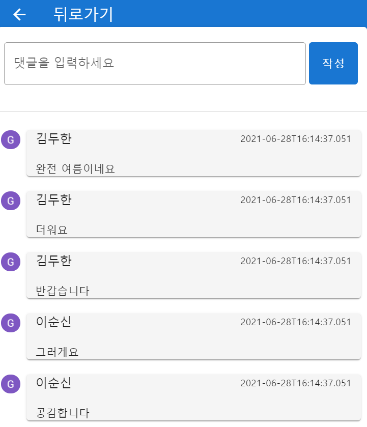

## Getting Started
Springboot + GraphQL + Vue 를 사용한 게시판 샘플 프로젝트(인증 및 인가, JPA N+1)

### Skills
- Spring Boot 2
- Spring Data JPA
- Spring Security
- GraphQL-Java
- Vue
- Vue Router
- Vue Apollo
- Vuetify

### Prerequisties

- Java 1.8
- Lombok plungins

### Run in development

```java
# build project
mvn package
```
DB Console
* http://localhost:8080/h2-console/

Graphql Console
* http://localhost:8080/graphiql

### Dependencies

|           Dependency           |    Version    |
| :----------------------------: | :-----------: |
|          spring-boot           |    2.4.7      |
|  spring-boot-starter-data-jpa  |               |
| spring-boot-starter-validation |               |
|    spring-boot-starter-web     |               |
|    spring-boot-starter-test    |               |
|       com.h2database:h2        |               |
|  graphql-spring-boot-starter   |     11.0      |
|  graphiql-spring-boot-starter  |     11.0      |
|      graphql-java-tools        |     11.0      |
|graphql-spring-boot-starter-test|     11.0      |
|voyager-spring-boot-starter     |     11.0      |

### Entity Diagram   
     
 
 
### Graphql Schema
     

user.graphqls
```shell script
type User {
    id: Float!
    name: String!
    email: String!
    createDateTime: String!
    posts: [Post]
    comments: [Comment]
}

input UserInput {
    name: String!
    email: String!
}

input LoginInput {
    name: String!
    password: String!
}

type Query {
    findAllUser : [User]!
    findByUserId(id: Float) : User
}

type Mutation {
    addUser(input: UserInput) : User
    login(name: String!, password: String!) : String!
}

schema {
    query: Query
    mutation: Mutation
}
```

post.graphqls
```shell script

type Post {
    id: Float!
    title: String!
    createDateTime: String!
    user: User!
    comments: [Comment]
}

input PostInput {
    userId: Float!
    title: String!
}

extend type Query {
    posts: [Post]
    findByPostId(postId: Float!): Post
}

extend type Mutation {
    addPost(input: PostInput!): Post!
}
```

comment.graphqls
```shell script
type Comment {
    id: Float!
    title: String!
    user: User!
    createDateTime: String!
    post: Post!
}

input CommentInput {
    title: String!
    userId: Float!
    postId: Float!
}

extend type Query {
    comments: [Comment]
}

extend type Mutation {
    addComment(input: CommentInput!): Comment!
}
```
 
### Examples
API Endpoint : http://localhost:8080/graphql

* 전체 유저 조회
```shell script
## Request body
query {
  findAllUser {
    name
    posts{
      title
    }
    comments{
      title
    }
  }
}

## Response body
{
  "data": {
    "findAllUser": [
      {
        "name": "name1",
        "posts": [
          {
            "title": "포스트1"
          },
          {
            "title": "포스트2"
          },
          {
            "title": "포스트3"
          }
        ],
        "comments": [
          {
            "title": "제목1"
          },
          {
            "title": "제목2"
          },
          {
            "title": "제목3"
          },
          {
            "title": "제목4"
          },
          {
            "title": "gift"
          },
          {
            "title": "gift"
          },
          {
            "title": "gift"
          },
          {
            "title": "gift"
          },
          {
            "title": "gift"
          },
          {
            "title": "gift"
          },
          {
            "title": "gift"
          }
        ]
      },
      {
        "name": "name2",
        "posts": [
          {
            "title": "포스트4"
          }
        ],
        "comments": [
          {
            "title": "제목5"
          }
        ]
      },
      {
        "name": "name3",
        "posts": [
          {
            "title": "포스트5"
          }
        ],
        "comments": [
          {
            "title": "제목6"
          },
          {
            "title": "제목7"
          }
        ]
      }
    ]
  }
}
```

* 전체 게시물 조회
```shell script
## Reqeust Body
query {
  posts {
    title
    user {
      name
    }
  }
}


## Response Body
{
  "data": {
    "posts": [
      {
        "title": "포스트1",
        "user": {
          "name": "name1"
        }
      },
      {
        "title": "포스트2",
        "user": {
          "name": "name1"
        }
      },
      {
        "title": "포스트3",
        "user": {
          "name": "name1"
        }
      },
      {
        "title": "포스트4",
        "user": {
          "name": "name2"
        }
      },
      {
        "title": "포스트5",
        "user": {
          "name": "name3"
        }
      }
    ]
  }
}
```

* 전체 댓글 조회
```shell script
## Request BOdy
query {
  comments {
    id
    title
    user {
      name
    }
  }
}

## Response Body
{
  "data": {
    "comments": [
      {
        "id": 1,
        "title": "제목1",
        "user": {
          "name": "name1"
        }
      },
      {
        "id": 2,
        "title": "제목2",
        "user": {
          "name": "name1"
        }
      },
      {
        "id": 3,
        "title": "제목3",
        "user": {
          "name": "name1"
        }
      },
      {
        "id": 4,
        "title": "제목4",
        "user": {
          "name": "name1"
        }
      },
      {
        "id": 5,
        "title": "제목5",
        "user": {
          "name": "name2"
        }
      },
      {
        "id": 6,
        "title": "제목6",
        "user": {
          "name": "name3"
        }
      },
      {
        "id": 7,
        "title": "제목7",
        "user": {
          "name": "name3"
        }
      }
    ]
  }
}
```

* 유저 추가
```shell script
## Request Body
mutation {
  addUser(input: {name: "Hong Gil Dong", email: "gildong@mail.com"}){
    id
    name
    email
  }
}

## Responose Body
{
  "data": {
    "addUser": {
      "id": 6,
      "name": "Hong Gil Dong",
      "email": "gildong@mail.com"
    }
  }
}
```

* 게시물 추가
```shell script
## Request Body
mutation {
  addPost(input: {title: "새로운 개사물을 씁니다", userId: 1}){
    id
    title
    user {
      name
    }
  }
}


## Responose Body
{
  "data": {
    "addPost": {
      "id": 6,
      "title": "새로운 개사물을 씁니다",
      "user": {
        "name": "name1"
      }
    }
  }
}
```


* 댓글 추가
```shell script
## Request Body
mutation {
  addComment(input: {title: "댓글을 씁니다", userId: 1, postId: 1}){
    id
    title
    post{
      title
    }
    user{
      name
    }
  }
}


## Responose Body
{
  "data": {
    "addComment": {
      "id": 8,
      "title": "댓글을 씁니다",
      "post": {
        "title": "포스트1"
      },
      "user": {
        "name": "name1"
      }
    }
  }
}
```

### Screenshot
    

    